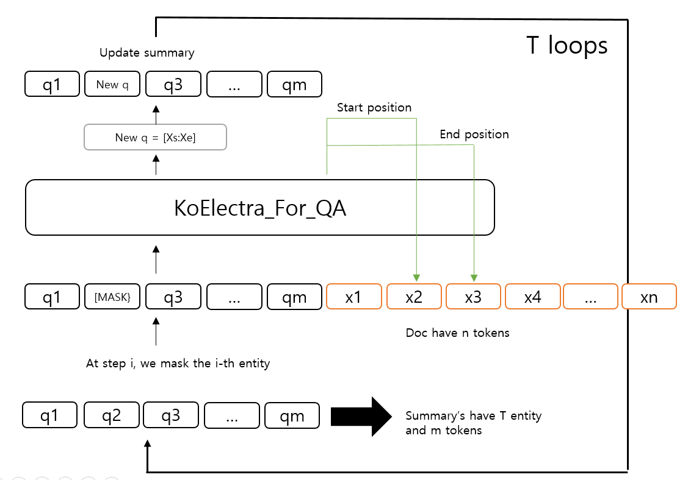

# QA-Span-Fact-Correction

#### Paper: [Multi-Fact Correction in Abstractive Text Summarization](https://arxiv.org/abs/2010.02443)

## Requirements
```
pytorch==1.7.1
transformers==4.3.3
```
## Data
- [Dacon 한국어 문서 생성요약 AI 경진대회](https://dacon.io/competitions/official/235673/overview/) 의 학습 데이터를 활용함
- 국립 국어원 Data set
- 기사 원문 context, 개체명이 마스킹된 요약문이 question으로 주어짐
- Data 구조
  - paragraphs
    - qas 
      - answer : [text, answer_start]
      - id : (기사 ID) - (질문 번호)
      - question : 정답 개체명이 Masking된 요약문
    - context : 기사 본문
  - title : (기사 ID)
 
 ## Model architecture
 
      
